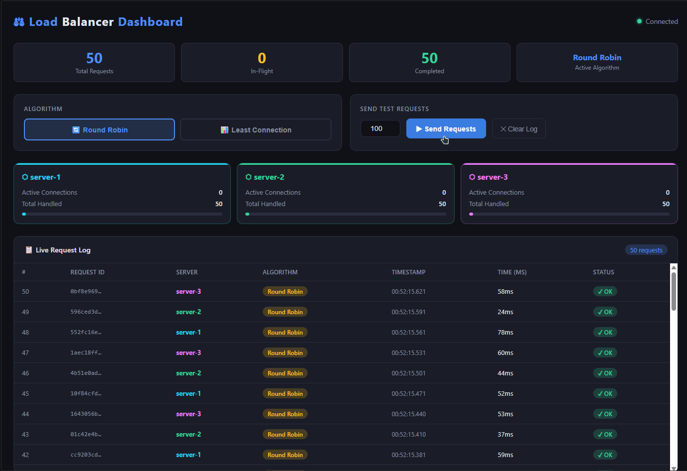
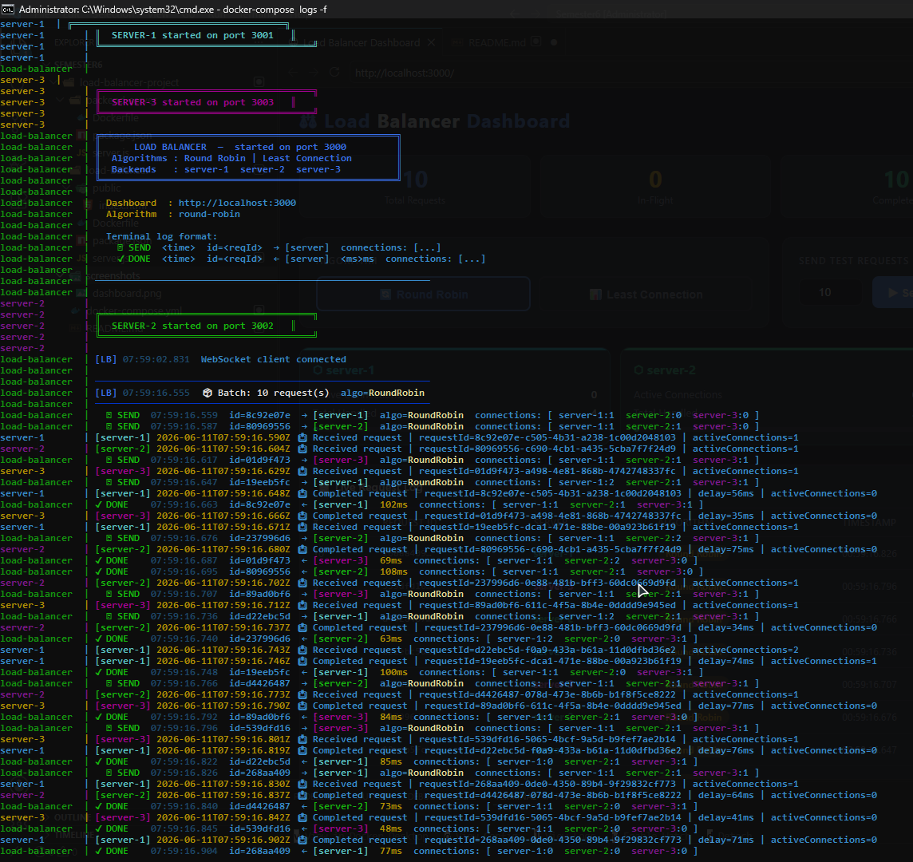
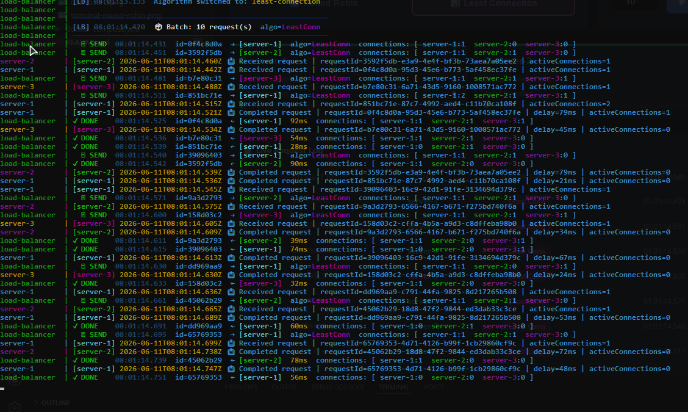
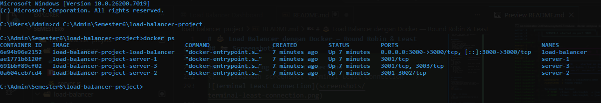

# ⚖️ Load Balancer dengan Docker — Round Robin & Least Connection

> Simulasi Load Balancer menggunakan **Node.js**, **Docker**, dan **WebSocket** dengan dua algoritma distribusi: **Round Robin** dan **Least Connection**. Dilengkapi **real-time dashboard** berbasis web dan **terminal logging berwarna**.

---

## 📋 Daftar Isi

- [Deskripsi](#-deskripsi)
- [Arsitektur](#-arsitektur)
- [Algoritma](#-algoritma)
- [Teknologi](#-teknologi)
- [Struktur Proyek](#-struktur-proyek)
- [Cara Menjalankan](#-cara-menjalankan)
- [Penggunaan Dashboard](#-penggunaan-dashboard)
- [Terminal Output](#-terminal-output)
- [Screenshots](#-screenshots)

---

## 📖 Deskripsi

Proyek ini mensimulasikan sistem **Load Balancer** yang mendistribusikan request HTTP ke **3 backend server** menggunakan dua algoritma berbeda. Semua service berjalan di dalam **Docker container** yang saling terhubung melalui Docker network.

Pengguna dapat:
- **Mengganti algoritma** secara real-time melalui Web UI
- **Mengirim batch request** dan melihat distribusinya langsung
- **Memantau** jumlah koneksi aktif tiap server secara live
- **Melihat log berwarna** di terminal setiap request masuk dan selesai

---

## 🏗️ Arsitektur

```
┌─────────────────────────────────────────────────────────┐
│                      Browser                            │
│              http://localhost:3000                      │
└──────────────────────┬──────────────────────────────────┘
                       │ HTTP + WebSocket
┌──────────────────────▼──────────────────────────────────┐
│              Load Balancer  (port 3000)                 │
│         Round Robin  /  Least Connection                │
│              Serve Web UI + WebSocket                   │
└──────┬─────────────────┬──────────────────┬─────────────┘
       │                 │                  │
       ▼                 ▼                  ▼
┌──────────────┐ ┌──────────────┐ ┌──────────────┐
│   server-1   │ │   server-2   │ │   server-3   │
│  port 3001   │ │  port 3002   │ │  port 3003   │
└──────────────┘ └──────────────┘ └──────────────┘

         Semua container dalam satu Docker network: lb-network
```

---

## 🔄 Algoritma

### 1. Round Robin
Mendistribusikan request secara **bergiliran** ke setiap server secara merata.

```
Request 1  →  server-1
Request 2  →  server-2
Request 3  →  server-3
Request 4  →  server-1  (kembali dari awal)
...
```

**Cocok untuk:** Server dengan kapasitas setara dan beban yang seragam.

---

### 2. Least Connection
Mendistribusikan request ke server yang memiliki **paling sedikit koneksi aktif** saat ini.

```
server-1: 3 koneksi aktif
server-2: 1 koneksi aktif  ← dipilih (paling sedikit)
server-3: 2 koneksi aktif

Request berikutnya → server-2
```

**Cocok untuk:** Beban kerja yang bervariasi, server dengan kemampuan berbeda.

---

### Perbandingan

| Fitur | Round Robin | Least Connection |
|---|---|---|
| Distribusi | Merata bergiliran | Berdasarkan beban nyata |
| Kompleksitas | O(1) | O(n) |
| Cocok untuk | Beban seragam | Beban bervariasi |
| Responsif terhadap beban | ❌ | ✅ |

---

## 🛠️ Teknologi

| Komponen | Teknologi |
|---|---|
| Runtime | Node.js 18 (Alpine) |
| Web Framework | Express.js |
| Real-time komunikasi | WebSocket (`ws` library) |
| HTTP Proxy | `http-proxy` |
| Containerisasi | Docker + Docker Compose |
| Web UI | HTML5 / CSS3 / Vanilla JS |

---

## 📁 Struktur Proyek

```
load-balancer-project/
│
├── docker-compose.yml          # Orkestrasi semua container
│
├── backend-server/             # Shared image untuk 3 backend
│   ├── Dockerfile
│   ├── package.json
│   └── server.js               # Express server, tracking koneksi aktif
│
└── load-balancer/              # Load balancer + Web UI
    ├── Dockerfile
    ├── package.json
    ├── server.js               # Core: Round Robin, Least Connection, WebSocket
    └── public/
        └── index.html          # Real-time dashboard
```

---

## 🚀 Cara Menjalankan

### Prasyarat

Pastikan sudah terinstall:
- [Docker Desktop](https://www.docker.com/products/docker-desktop/) (Windows/Mac) atau Docker Engine (Linux)
- Docker Compose (sudah termasuk di Docker Desktop)

Cek instalasi:
```bash
docker --version
docker compose version
```

---

### Langkah 1 — Clone Repository

```bash
git clone https://github.com/<username>/<repo-name>.git
cd <repo-name>
```

---

### Langkah 2 — Build & Jalankan Semua Container

```bash
docker-compose up --build
```

Perintah ini akan:
1. Build image `backend-server` (digunakan 3x dengan env berbeda)
2. Build image `load-balancer`
3. Membuat Docker network `lb-network`
4. Menjalankan 4 container: `server-1`, `server-2`, `server-3`, `load-balancer`

Tunggu hingga muncul output:
```
╔═════════════════════════════════════════════════════╗
║      LOAD BALANCER  —  started on port 3000         ║
╚═════════════════════════════════════════════════════╝
  Dashboard  : http://localhost:3000
```

---

### Langkah 3 — Buka Dashboard

Buka browser dan akses:
```
http://localhost:3000
```

---

### Cek Status Container

```bash
# Lihat semua container yang berjalan
docker ps

# Lihat status lengkap via compose
docker-compose ps
```

Output yang diharapkan:
```
NAME                    STATUS          PORTS
load-balancer           running         0.0.0.0:3000->3000/tcp
server-1                running
server-2                running
server-3                running
```

---

### Melihat Log Terminal Real-Time

```bash
# Semua container (digabung)
docker-compose logs -f

# Hanya load balancer (rekomendasi)
docker-compose logs -f load-balancer

# Backend server tertentu
docker-compose logs -f server-1
docker-compose logs -f server-2
docker-compose logs -f server-3
```

---

### Menghentikan Semua Container

```bash
# Stop tanpa hapus container
docker-compose stop

# Stop dan hapus container + network
docker-compose down
```

---

## 🖥️ Penggunaan Dashboard

Setelah membuka `http://localhost:3000`:

| Fitur | Cara Pakai |
|---|---|
| Ganti algoritma | Klik tombol **Round Robin** atau **Least Connection** |
| Kirim request | Atur jumlah di input box → klik **▶ Send Requests** |
| Hapus log | Klik tombol **✕ Clear Log** |
| Status server | Lihat 3 kartu server di tengah halaman |
| Log request | Tabel di bawah update otomatis via WebSocket |

---

## 📟 Terminal Output

Setiap request akan menampilkan log berwarna di terminal:

```
────────────────────────────────────────────────────────────
[LB] 00:05:12.341  📦 Batch: 9 request(s)  algo=RoundRobin
────────────────────────────────────────────────────────────
  ▶ SEND  00:05:12.342  id=a3f1b2c0  → [server-1]  connections: [ server-1:1  server-2:0  server-3:0 ]
  ▶ SEND  00:05:12.372  id=b9e4d1f0  → [server-2]  connections: [ server-1:1  server-2:1  server-3:0 ]
  ▶ SEND  00:05:12.402  id=c7a2e3b1  → [server-3]  connections: [ server-1:1  server-2:1  server-3:1 ]
  ✓ DONE  00:05:12.398  id=a3f1b2c0  ← [server-1]  56ms  connections: [ server-1:0  server-2:1  server-3:1 ]
  ✓ DONE  00:05:12.421  id=b9e4d1f0  ← [server-2]  49ms  connections: [ server-1:0  server-2:0  server-3:1 ]
  ✓ DONE  00:05:12.455  id=c7a2e3b1  ← [server-3]  53ms  connections: [ server-1:0  server-2:0  server-3:0 ]
```

Keterangan warna:
- 🔵 **Biru** — Load Balancer info
- 🟢 **Hijau** — server-2 / request berhasil (✓ DONE)
- 🔵 **Cyan** — server-1
- 🟣 **Magenta** — server-3 / Least Connection label
- 🟡 **Kuning** — Round Robin label / waktu respon (ms)

---

## 📸 Screenshots

### Dashboard Web — Real-time Request Log
<!-- Tambahkan screenshot dashboard di sini -->


### Terminal Log — Round Robin
<!-- Tambahkan screenshot terminal Round Robin -->


### Terminal Log — Least Connection
<!-- Tambahkan screenshot terminal Least Connection -->


### Docker Containers Running
<!-- Tambahkan screenshot docker ps atau docker stats -->


> **Cara menambahkan screenshot:**
> 1. Buat folder `screenshots/` di root project
> 2. Ambil screenshot dan simpan dengan nama sesuai di atas
> 3. Push ke GitHub — gambar akan otomatis tampil di README

---

## 👤 Author

| Info | Detail |
|---|---|
| Nama | *(isi nama kamu)* |
| NIM | *(isi NIM kamu)* |
| Mata Kuliah | *(isi nama mata kuliah)* |
| Semester | 6 |

---

## 📄 Lisensi

Project ini dibuat untuk keperluan tugas akademik.
